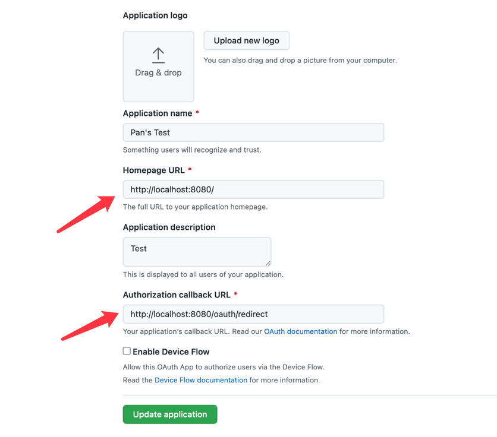
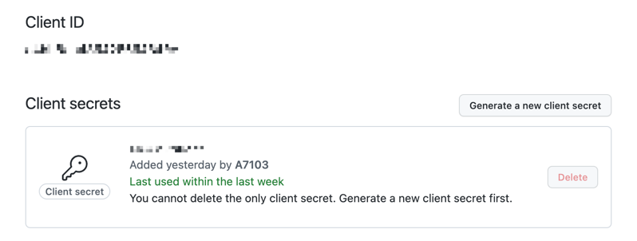
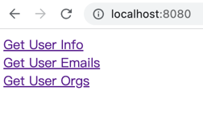

# github oauth
Go package that simple use for github oauth

## How to run?
1. Read the [github doc](https://docs.github.com/en/developers/apps/building-oauth-apps/creating-an-oauth-app) for create an Oauth app
2. Set Homepage URL to `http://localhost:8080/`, Set Authorization callback URL to `http://localhost:8080/oauth/redirect`
   - 
3. Get `Client ID` and `Client Secret`
   - 
4. Populate them into [dev_env](dev_env) file
   - `GITHUB_OAUTH_ClientID` = `Client ID`
   - `GITHUB_OAUTH_ClientSecret` = `Client Secret`
   - `GITHUB_OAUTH_RedirectURL` = Authorization callback URL (`http://localhost:8080/oauth/redirect`)
5. Open you terminal, execute the following code in order:
   ```go
   go get -v -u ./...
   ```
   ```shell
   source dev_env
   ```
   ```go
   go run main.go
   ```
6. Now you can do something in `localhost:8080`
   